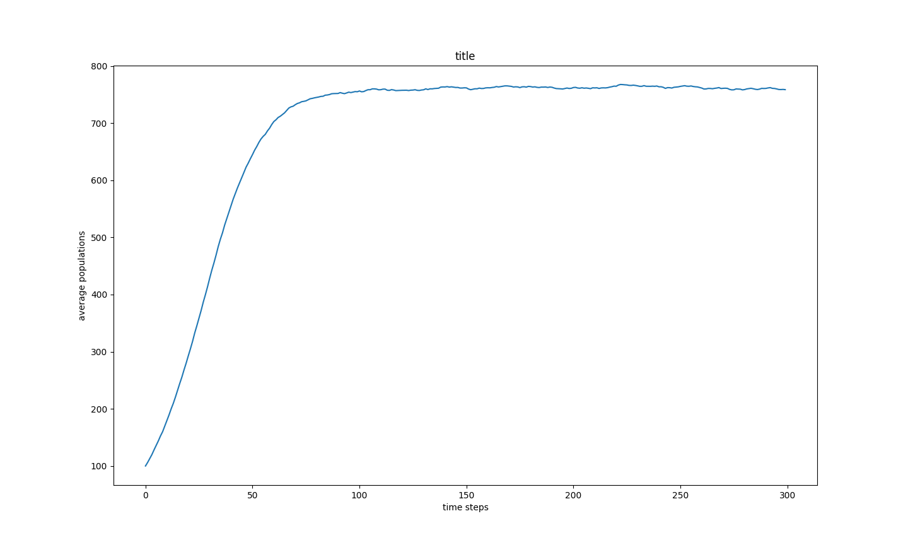
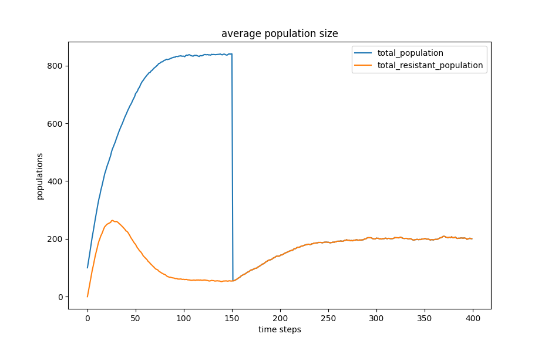
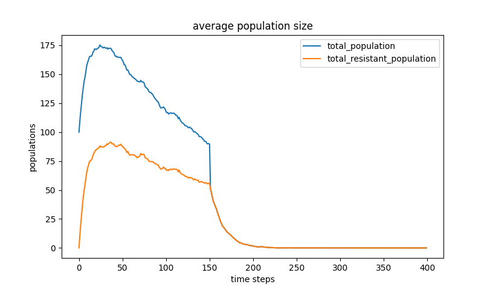

Problem 2:

95% confidence interval at timestep 299:
Mean 758.62
CI: 754.6734768492761, 762.5665231507239

Problem 5:

Simulation A
95% confidence interval at timestep 299 for simulation A total population:
Mean 200.58
CI: 192.89418244588126, 208.26581755411877

95% confidence interval at timestep 299 for simulation A resistant population:
Mean 200.58
CI: 192.89418244588126, 208.26581755411877

Simulation B
95% confidence interval at timestep 299 for simulation B total population:
Mean 0.1
CI: -0.09403010075758877, 0.2940301007575888

95% confidence interval at timestep 299 for simulation B resistant population:
Mean 0.1
CI: -0.09403010075758877, 0.2940301007575888

Trends of Simulation A and Simulation B

1. What happens to the total population before introducing the antibiotic?
In simulation A before the antibiotic was introduced the population was growing steadily until it
started to plateau around 100 time steps. In simulation B, due to the lower birth probability, the population went from increasing to decreasing around time step 20-30. This is due to the fact that the reproduction rate did not exceed the death rate. 

2. What happens to the resistant bacteria population before introducing the antibiotic?
In simulation A the resistant bacteria population peaked around timestep 20 and then started to decrease. The population plateaued between timestep 90 until the antibiotic was introduced. 

The same behavior is observed in simulation B. 

The population declines in both because of the inherent trade off between reproduction 
and population density. 

3. What happens to the total population after introducing the antibiotic?
The total population in both simulation A and simulation B collapse after the introduction
of the antibiotic. After time step 150 the trend line of total bacteria is equivalent with the trend line of resistant bacteria, implying that all bacteria that remain are resistant. 

4. What happens to the resistant bacteria population after introducing the antibiotic?

Based on the set birth probability the population behavior of the resistant population differs between simulation A and simulation B. Due to simulation A's higher birth probability the resistant population steadily increases after the antibiotic is introduced and then plateaus around 250. Due to it's lower birth probability, simulation B's resistant population continue to decrease until it plataues around time step 200.